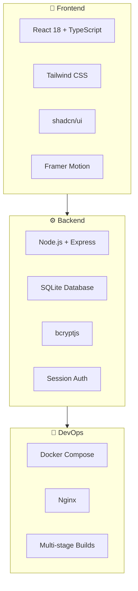

<div align="center">

# 📚 College Timetable Optimizer

### 🚀 A modern, full-stack web application for streamlined college timetable management


[](https://opensource.org/licenses/MIT)
[](http://makeapullrequest.com)

[🌟 Features](#-features) • [⚡ Quick Start](#-quick-start) • [🛠️ Tech Stack](#-tech-stack) • [📖 Documentation](#-api-endpoints)

</div>

---

## 🎯 Project Overview

> **Built for hackathons, designed for production** 🏆

This comprehensive timetable management system showcases modern web development practices with:

<table>
<tr>
<td width="50%">

**🎨 Frontend Excellence**
- ⚡ React 18 + TypeScript
- 🎨 Tailwind CSS + shadcn/ui
- ✨ Framer Motion animations
- 📱 Fully responsive design
- 🔐 Secure authentication

</td>
<td width="50%">

**⚙️ Backend Power**
- 🚀 Express.js + Node.js
- 💾 SQLite database
- 🔒 bcrypt password hashing
- 🌐 RESTful API architecture
- 🐳 Docker containerization

</td>
</tr>
</table>

## ✨ Key Features

<div align="center">

| 🔐 **Authentication** | 📊 **Dashboard** | 📅 **Management** | 🎨 **UI/UX** |
|:---:|:---:|:---:|:---:|
| Secure login system | Interactive forms | Complete CRUD ops | Modern gradients |
| Session persistence | Dynamic subjects | Tabular displays | Smooth animations |
| Demo credentials | Faculty assignment | Real-time updates | Mobile responsive |

</div>

### 🚀 **What makes it special?**

- 🎯 **One-click deployment** with Docker Compose
- ⚡ **Lightning fast** development with hot reload
- 🔒 **Production-ready** security features
- 📱 **Mobile-first** responsive design
- 🎨 **Modern aesthetics** with shadcn/ui components
- 🧪 **Test-ready** architecture

## 🛠️ Tech Stack

<div align="center">



</div>

| Layer | Technologies | Purpose |
|-------|-------------|----------|
| **🎨 Frontend** | React 18, TypeScript, Tailwind CSS, shadcn/ui | Modern, type-safe UI with beautiful components |
| **⚙️ Backend** | Node.js, Express, SQLite, bcryptjs | Robust API with secure authentication |
| **🐳 DevOps** | Docker, Docker Compose, Nginx | Containerized deployment & production serving |

## ⚡ Quick Start

> 🎯 **Get up and running in under 2 minutes!**

### 📋 Prerequisites
```bash
✅ Docker & Docker Compose
✅ Git
```

### 🚀 Installation

<details>
<summary>🔧 <strong>Option 1: Docker (Recommended)</strong></summary>

```bash
# 1️⃣ Clone the repository
git clone https://github.com/your-username/college-timetable-optimizer.git
cd college-timetable-optimizer

# 2️⃣ Launch everything with one command
docker-compose up --build

# 🎉 That's it! Open http://localhost:3000
```

</details>

<details>
<summary>⚙️ <strong>Option 2: Development Setup</strong></summary>

```bash
# Backend
cd backend
npm install
npm run dev

# Frontend (new terminal)
cd frontend
npm install
npm start
```

</details>

### 🌐 Access Points

| Service | URL | Status |
|---------|-----|--------|
| 🖥️ **Frontend** | http://localhost:3000 | Main Application |
| 🔌 **Backend API** | http://localhost:5000 | REST API |

### 🔑 Demo Credentials

<div align="center">

| 👤 Username | 🔐 Password |
|:----------:|:-----------:|
| `admin` | `admin123` |

*Ready to use • No setup required*

</div>

## 💻 Development Guide

### 🔥 Hot Reload Development

```bash
# 🚀 Backend (Port 5000)
cd backend && npm install && npm run dev

# 🎨 Frontend (Port 3000) 
cd frontend && npm install && npm start
```

### 📊 Development Commands

| Command | Purpose | Output |
|---------|---------|--------|
| `npm start` | Development server | http://localhost:3000 |
| `npm run build` | Production build | `build/` folder |
| `npm test` | Run test suite | Test results |
| `docker-compose up` | Full stack | Both services |

> 💡 **Pro Tip:** Use `docker-compose up -d` to run in background

## 📁 Project Structure

```
college-timetable-optimizer/
├── backend/
│   ├── server.js           # Main Express server
│   ├── package.json        # Backend dependencies
│   ├── Dockerfile          # Backend container config
│   └── .dockerignore
├── frontend/
│   ├── src/
│   │   ├── components/     # React components
│   │   │   ├── ui/        # Reusable UI components
│   │   │   ├── Login.tsx
│   │   │   ├── Dashboard.tsx
│   │   │   ├── TimetableDisplay.tsx
│   │   │   └── Navbar.tsx
│   │   ├── contexts/      # React contexts
│   │   │   └── AuthContext.tsx
│   │   ├── lib/           # Utility functions
│   │   │   └── utils.ts
│   │   └── App.tsx        # Main App component
│   ├── tailwind.config.js # Tailwind configuration
│   ├── nginx.conf         # Production nginx config
│   ├── Dockerfile         # Frontend container config
│   └── .dockerignore
├── docker-compose.yml     # Multi-service orchestration
└── README.md             # This file
```

## 📡 API Documentation

<div align="center">

### 🔌 **REST Endpoints**

</div>

| Method | Endpoint | Description | Auth Required |
|--------|----------|-------------|---------------|
| 🔐 **Authentication** |
| `POST` | `/api/login` | User authentication | ❌ |
| `POST` | `/api/logout` | End user session | ✅ |
| `GET` | `/api/auth/check` | Verify session status | ✅ |
| 📅 **Timetables** |
| `POST` | `/api/timetable/save` | Create new timetable | ✅ |
| `GET` | `/api/timetable/get` | Fetch user timetables | ✅ |
| `DELETE` | `/api/timetable/:id` | Remove timetable | ✅ |
| 🏥 **System** |
| `GET` | `/api/health` | Server status check | ❌ |

<details>
<summary>📋 <strong>Example API Calls</strong></summary>

```javascript
// Login
fetch('/api/login', {
  method: 'POST',
  headers: { 'Content-Type': 'application/json' },
  body: JSON.stringify({ username: 'admin', password: 'admin123' })
})

// Get Timetables
fetch('/api/timetable/get', {
  credentials: 'include'
})
```

</details>

## 🎛 Configuration

### Environment Variables
- `NODE_ENV` - Environment (development/production)
- `PORT` - Backend server port (default: 5000)

### Database
- Uses SQLite for simplicity
- Database file: `backend/database.sqlite`
- Auto-creates tables on startup
- Seeds demo user automatically

## 🐳 Docker Operations

<div align="center">

### 📦 **Container Management**

</div>

| Operation | Command | Description |
|-----------|---------|-------------|
| 🚀 **Start** | `docker-compose up --build` | Build & launch all services |
| 🔄 **Background** | `docker-compose up -d` | Run detached mode |
| 🛑 **Stop** | `docker-compose down` | Graceful shutdown |
| 📋 **Logs** | `docker-compose logs -f` | Follow real-time logs |
| 🔄 **Fresh Start** | `docker-compose down -v` | Reset everything |

<details>
<summary>🔧 <strong>Advanced Docker Commands</strong></summary>

```bash
# Build specific service
docker-compose build frontend

# Scale services
docker-compose up --scale backend=2

# Execute commands in containers
docker-compose exec frontend npm test
docker-compose exec backend npm run migrate

# Monitor resource usage
docker stats
```

</details>

## 🎨 Design System

### Colors
- Primary: Blue gradient (blue-600 to purple-600)
- Background: Soft gradients (blue-50, white, purple-50)
- Cards: White with transparency and backdrop blur
- Text: Gray scale for hierarchy

### Components
- Cards with subtle shadows and rounded corners
- Buttons with hover animations and gradients
- Form inputs with focus states
- Tables with hover effects
- Icons from Lucide React

## 📱 Responsive Design

- Mobile-first approach
- Breakpoints: sm, md, lg, xl, 2xl
- Collapsible navigation on mobile
- Grid layouts that adapt to screen size
- Touch-friendly button sizes

## 🔒 Security Features

- Password hashing with bcryptjs
- Session-based authentication
- CORS configuration
- SQL injection protection with parameterized queries
- Input validation and sanitization

## 🚀 Deployment Notes

### Production Considerations
- Environment variables for configuration
- Database backup strategies
- SSL/HTTPS setup
- Load balancing for scalability
- Monitoring and logging

### Docker Production
- Multi-stage builds for smaller images
- Health checks for container orchestration
- Volume persistence for database
- Network isolation

## 🎯 Hackathon Features Demo

### Judge Evaluation Points
1. **Login Flow**: Demo account works instantly
2. **UI/UX**: Modern, professional design
3. **Form Handling**: Dynamic subject addition
4. **Data Persistence**: Saved timetables viewable
5. **Responsiveness**: Works on all devices
6. **Tech Stack**: Modern React + Node.js
7. **Docker**: Easy one-command deployment

### Demo Scenario
1. Access http://localhost:3000
2. Login with admin/admin123
3. Create a new timetable with multiple subjects
4. View saved timetables in the table
5. Inspect timetable details
6. Test responsive design on different screen sizes

## 🔧 Troubleshooting Guide

<details>
<summary>🚨 <strong>Common Issues & Solutions</strong></summary>

### 🔌 Port Conflicts
```bash
# Check port usage
netstat -an | grep :3000  # Frontend
netstat -an | grep :5000  # Backend

# Kill processes
npx kill-port 3000 5000
```

### 🐳 Docker Issues
```bash
# Nuclear option - rebuild everything
docker-compose down -v
docker-compose build --no-cache
docker-compose up

# Check container status
docker-compose ps
docker-compose logs [service-name]
```

### 💾 Database Issues
```bash
# Reset database
rm backend/database.sqlite
docker-compose restart backend
```

### 🆘 Emergency Reset
```bash
# Complete project reset
git clean -fdx
docker system prune -af
docker-compose up --build
```

</details>

---

<div align="center">

### 🎯 **Still having issues?** 

[Open an Issue](https://github.com/your-username/college-timetable-optimizer/issues) • [Discussion](https://github.com/your-username/college-timetable-optimizer/discussions)

</div>

## 🤝 Contributing

<div align="center">

### 🚀 **Join the Development!**

*This hackathon project welcomes contributions from developers of all skill levels*

</div>

| Step | Action | Description |
|------|--------|-------------|
| 1️⃣ | **Fork** | Click the fork button |
| 2️⃣ | **Clone** | `git clone your-fork-url` |
| 3️⃣ | **Branch** | `git checkout -b feature/amazing-feature` |
| 4️⃣ | **Code** | Make your awesome changes |
| 5️⃣ | **Test** | `npm test && docker-compose up` |
| 6️⃣ | **PR** | Submit a pull request |

<details>
<summary>💡 <strong>Contribution Ideas</strong></summary>

- 🎨 UI/UX improvements
- 🔧 New features (export, import, scheduling algorithms)
- 🐛 Bug fixes and optimizations
- 📚 Documentation enhancements
- 🧪 Test coverage improvements
- 🌐 Internationalization

</details>

---

## 📄 License

<div align="center">

**MIT License** - feel free to use this project for learning, hackathons, or production!

[](https://opensource.org/licenses/MIT)

</div>

---

## 🙏 Acknowledgments

<div align="center">

### 🌟 **Built with amazing open-source tools**

| Technology | Team/Creator | Why We Love It |
|------------|-------------|----------------|
| ⚛️ **React** | Meta | The foundation of modern UI |
| 🎨 **Tailwind** | Tailwind Labs | Utility-first CSS magic |
| 🧩 **shadcn/ui** | shadcn | Beautiful, accessible components |
| 🚀 **Vercel** | Vercel Team | Inspiration for modern DX |

</div>

---

<div align="center">

### 🏆 **Built with ❤️ for hackathons by Team Eclipse**

*⭐ Star this repo if you found it helpful!*

[🐛 Report Bug](https://github.com/your-username/college-timetable-optimizer/issues) • [✨ Request Feature](https://github.com/your-username/college-timetable-optimizer/issues) • [💬 Discuss](https://github.com/your-username/college-timetable-optimizer/discussions)

**Made with 🔥 by passionate developers**

</div>
